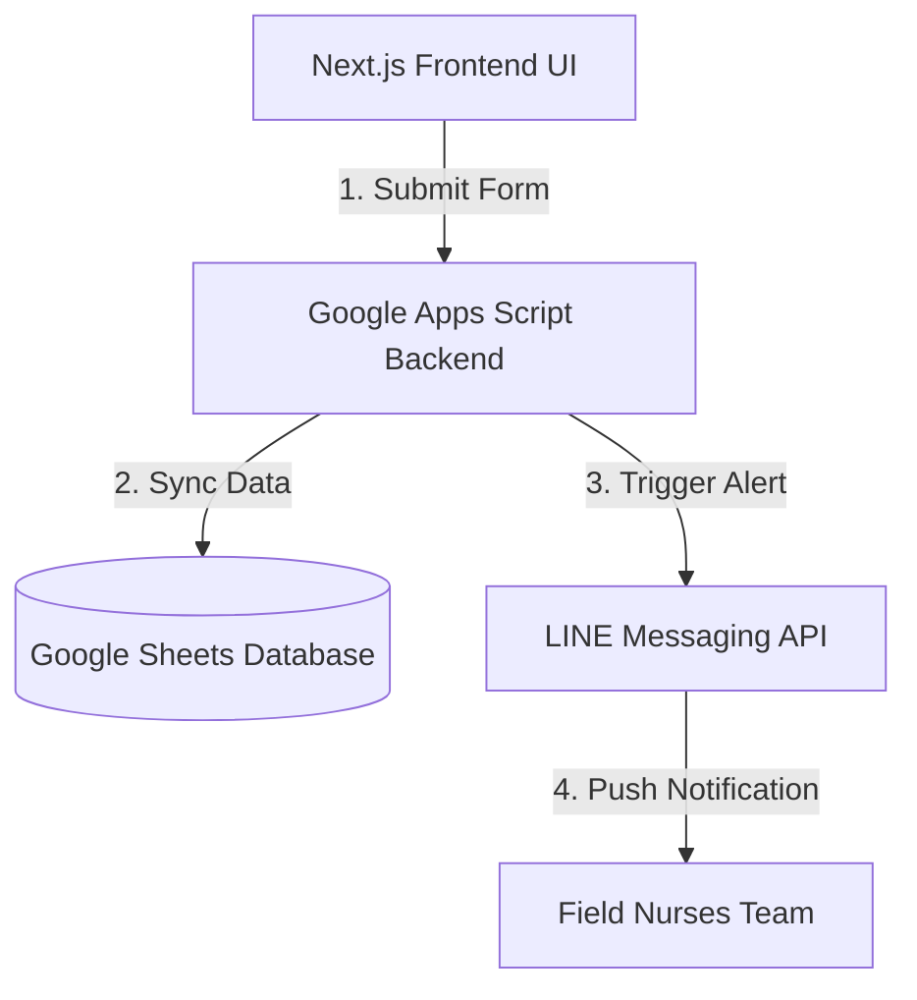

<h1 align="center">Patient Intake System</h1>

<p align="center">
  <strong>Modern Digital Intake Platform for Community Healthcare</strong><br>
  <sub>Streamlining patient registration, lookup, and communication for real-world clinical workflows</sub>
</p>

<p align="center">
  
  
  
</p>

---

## 🧠 The Problem

Community healthcare teams still rely heavily on manual patient intake processes:

- Paper-based registration slows down operations
- Patient lookup is time-consuming and error-prone
- Communication between staff and patients is fragmented
- Data inconsistency across systems

---

## 💡 The Solution

**Patient Intake System** digitizes and automates the intake workflow:

- Instant patient registration
- Fast patient lookup
- LINE-based communication
- Real-time synchronization with Google Sheets

Designed specifically for **field nurses and municipal healthcare teams**

---

## ⚙️ Core Features

- 🧑‍⚕️ Patient Registration
- 🔍 Instant Patient Lookup
- 💬 LINE Messaging Integration
- 📊 Real-time Google Sheets Sync
- 🔔 Automated Appointment Notification
- ⚡ Lightweight UI (Next.js)

---

## 📈 Impact

- ⬇ Reduced manual data entry workload
- ⬆ Improved intake speed
- ⬆ Increased data accuracy
- 🏥 Applied in municipal healthcare workflows

---

## 🧱 Tech Stack

- Frontend: Next.js
- Backend Services: Google Apps Script
- Messaging: LINE Messaging API
- Database: Google Sheets
- UI: Tailwind CSS

---

## 🔌 Integrations

### LINE Messaging API

Used to notify healthcare staff automatically.

Endpoint:
```txt
POST /v2/bot/message/push
```

---

### Google Apps Script Web App

Used for patient registration, lookup, dashboard data, and appointment workflows.

Endpoints:

```txt
GET  /exec
POST /exec
```

Supported actions:

```txt
register_new
register_existing
```

---

## 📖 API Usage Examples

### 1. Patient Registration (Google Apps Script)
To register a new patient via the Google Apps Script backend Web App module.

**Request Payload (`POST /exec?action=register_new`)**
```json
{
  "firstName": "John",
  "lastName": "Doe",
  "citizenId": "1100000000000",
  "phoneNumber": "0812345678",
  "symptoms": "Mild fever and cough for 2 days"
}
```

**Response (`200 OK`)**
```json
{
  "status": "success",
  "message": "Patient registered successfully",
  "data": {
    "patientId": "HN-2026-0001",
    "registrationTime": "2026-05-28T05:30:00.000Z"
  }
}
```

---

### 2. Staff Notification (LINE Messaging API)
Triggered automatically when a new patient registers to alert the field nurses.

**Request Payload (`POST /v2/bot/message/push`)**
```json
{
  "to": "your_line_admin_user_id",
  "messages": [
    {
      "type": "text",
      "text": "🚨 New Telemedicine Registration!\nName: John Doe\nSymptoms: Mild fever and cough for 2 days.\nPlease review the lookup queue."
    }
  ]
}
```

---

## 🏗 System Flow



---

## 🚀 Getting Started

```bash
git clone https://github.com/ratchanon-noknoy2318/patient-registration-platform-nextjs

cd patient-registration-platform-nextjs

npm install
npm run dev
```

Create `.env.local`

```env
CHANNEL_ACCESS_TOKEN=your_line_channel_access_token
ADMIN_USER_ID=your_line_user_id
APPS_SCRIPT_WEB_APP_URL=your_google_apps_script_web_app_url
```

---

